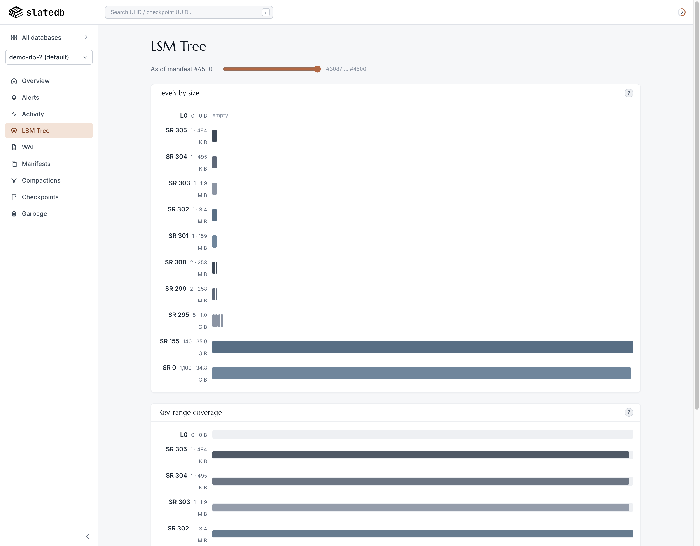
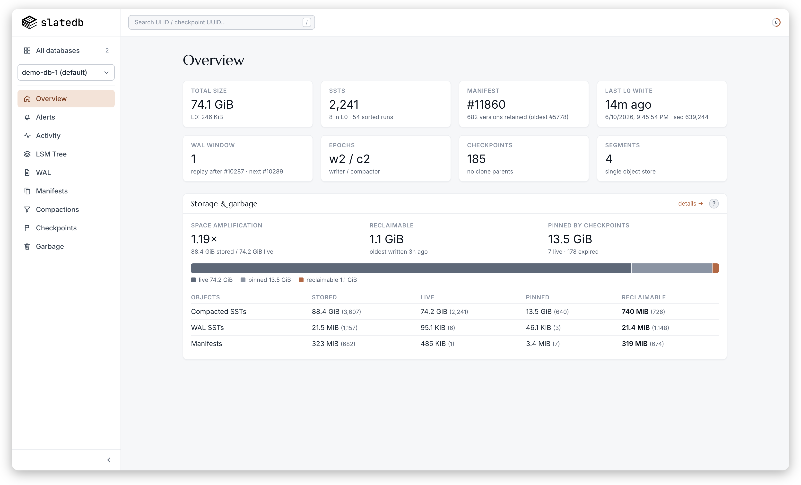

# Outcrop

An outcrop is where rock strata surface: visible, layer by layer, without
digging. **Outcrop** is a **read-only** web dashboard that does the same
for [SlateDB](https://slatedb.io): it inspects databases directly from
object storage, layer by layer.

SlateDB keeps all of its state (manifests, WAL SSTs, L0 SSTs, sorted runs,
checkpoints) in the object store, so the dashboard needs no cooperation from
the running writer. It performs **zero writes**: only manifest reads, SST
metadata reads, and object listings.

Built against SlateDB **0.14.x**; older or newer manifest formats may not
decode.

<p align="center">
  
</p>

<details>
<summary><strong>More screenshots</strong></summary>
<p align="center">
  
</p>
</details>

## Features

- **Reads the bucket, not the database**: zero writes, no agent, no writer
  cooperation.
- **Fleet auto-discovery**: point it at stores; every SlateDB in them
  appears.
- **Understands SlateDB**: semantic manifest diffs, a narrated activity
  feed, GC-accurate garbage accounting, health alerts.
- **Visualizes the LSM**: level sizes, key-range coverage (read amp),
  per-SST drill-down, manifest-history scrubber.
- **REST API with OpenAPI**: everything the UI shows is JSON; spec and
  interactive reference at `/api/docs`.
- **Prometheus metrics** at `/metrics`.
- **Cheap to poll**: cached, capped, bounded payloads; open dashboards
  won't run up your S3 bill.
- **One binary**: embedded SPA, `--api-only`/`--ui-only` splits, demo
  data generator included.

## Install

```sh
curl -fsSL https://raw.githubusercontent.com/criccomini/outcrop/main/install.sh | sh
```

Downloads the latest release for your platform (Linux x86_64/arm64, macOS
arm64), verifies its checksum, and installs to `~/.local/bin` (override
with `OUTCROP_INSTALL`; pin a version with `OUTCROP_VERSION`). Windows
and Intel-Mac users: grab a binary from the
[releases page](https://github.com/criccomini/outcrop/releases) or build
from source (see Development).

## Running

Everything is one binary, and DBs are **auto-discovered**: the dashboard
walks the configured object store(s) and detects a SlateDB wherever a
prefix has a `manifest/` directory with manifest files in it. The fleet
page lists every discovered DB; each DB gets its own URLs under `/db/{id}`.

```sh
# Single store from ambient env vars (exactly like slatedb-cli); scans the
# whole store by default, or scoped prefixes via --root (repeatable).
CLOUD_PROVIDER=local LOCAL_PATH=/path/to/store outcrop
CLOUD_PROVIDER=aws AWS_BUCKET=my-bucket ... outcrop serve --root dbs/

# Multiple stores via a self-contained TOML config:
outcrop serve --config stores.toml

# REST API only (no UI). CORS defaults to '*' in this mode so a ui-only
# instance can call it from the browser; restrict with --cors-allow-origin.
outcrop serve --api-only

# UI only: serves just the SPA, with the API base baked into index.html;
# the browser calls that API directly. No object-store config needed here.
outcrop serve --ui-only --api-url http://api-host:8333
```

`stores.toml` carries each store's provider settings inline, keyed by the
[documented env-var names](https://docs.rs/slatedb/latest/slatedb/admin/)
lowercased. Values may reference ambient env vars
with `${VAR}`: that's how multiple stores of the same provider use
different credentials without putting secrets in the file (unset keys also
fall through to the ambient env):

```toml
[[stores]]
name = "local"
provider = "local"            # local | memory | aws | azure
local_path = "/data/store"
roots = [""]                  # prefixes to scan (default: the store root)

[[stores]]
name = "prod"
provider = "aws"
aws_bucket = "prod-bucket"
aws_region = "us-east-1"
aws_access_key_id = "${PROD_AWS_KEY_ID}"
aws_secret_access_key = "${PROD_AWS_SECRET}"
roots = ["dbs/"]
```

Serve flags:

- `--config FILE`: multi-store TOML, or `--root PREFIX` (repeatable) to
  scope the ambient-env store
- `--listen ADDR` (default `127.0.0.1:8333`)
- `--cache-ttl-secs N` (default 5): object-store reads of mutable state
  are cached and shared across viewers, so polling cost stays bounded
- `--scan-depth N` (default 4), `--scan-ttl-secs N` (default 60): DB
  discovery
- `--api-only`, or `--ui-only --api-url URL`: split deployments
- `--cors-allow-origin ORIGIN` (repeatable)

The dashboard has **no authentication** and, while read-only, exposes DB
metadata (key ranges, checkpoint names, store paths). It binds to
localhost by default; to share it, put it behind a reverse proxy that
handles auth, or at least bind only to a trusted network.

## REST API

Everything the UI shows comes from a JSON API you can use directly:

- `GET /api/dbs`: discovered databases; per-DB resources live under
  `/api/dbs/{db}/…` where `{db}` is the id `{store}:{path}` as a single
  path segment (percent-encode any slashes in the path).
- `GET /api/openapi.json`: OpenAPI 3.1 document covering every endpoint
  and schema. Generate typed clients with any OpenAPI generator, e.g.
  `npx openapi-typescript http://127.0.0.1:8333/api/openapi.json`.
- `GET /api/docs`: interactive API reference rendering that spec (the
  viewer script loads from a CDN; the spec itself is self-contained).
- `GET /metrics`: Prometheus exposition for every discovered DB (sizes,
  SST counts, WAL window, epochs, manifest freshness), root-level by
  convention.

Errors are JSON `{"error": "..."}` with conventional status codes. List
endpoints cap their `limit` parameters server-side because every item can
cost an object-store request.

## Demo

```sh
# Seed three demo DBs into ./demo-data if missing, then simulate live
# traffic against all of them concurrently until Ctrl-C (this is the only
# mode that writes; the dashboard itself never does). Each DB runs at a
# different rate and phase, and randomly (but stably, by name) decides
# whether it's segmented (RFC-0024) so the fleet shows both shapes.
cargo run -- traffic              # --dbs, --rate, --checkpoint-secs, --segments
# add --clean to delete ./demo-data first and start from scratch

# Then watch them (the fleet page lists all three):
CLOUD_PROVIDER=local LOCAL_PATH=$(pwd)/demo-data cargo run
```

Note: `LOCAL_PATH` must be absolute; the object store canonicalizes it.

## Development

```sh
npm run dev --prefix web    # Vite dev server on :5173, proxies /api to :8333
npx tsc --noEmit            # typecheck the frontend (run inside web/)
cargo test                  # backend unit tests
./scripts/smoke.sh          # curl every endpoint against a running server

# Release binary with the frontend embedded (single-file deploy);
# needs Rust (stable) and Node 18+:
npm run build --prefix web && cargo build --release
```

In debug builds the server reads `web/dist` from disk, so after
`npm run build --prefix web` a running debug server picks up frontend
changes without a cargo rebuild; release builds embed the assets.
